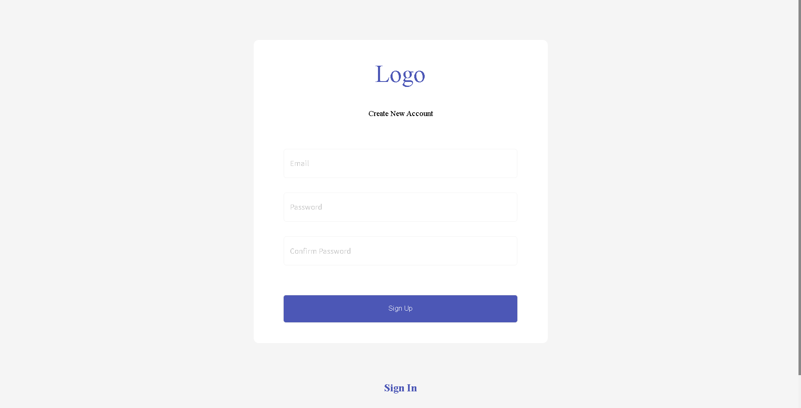
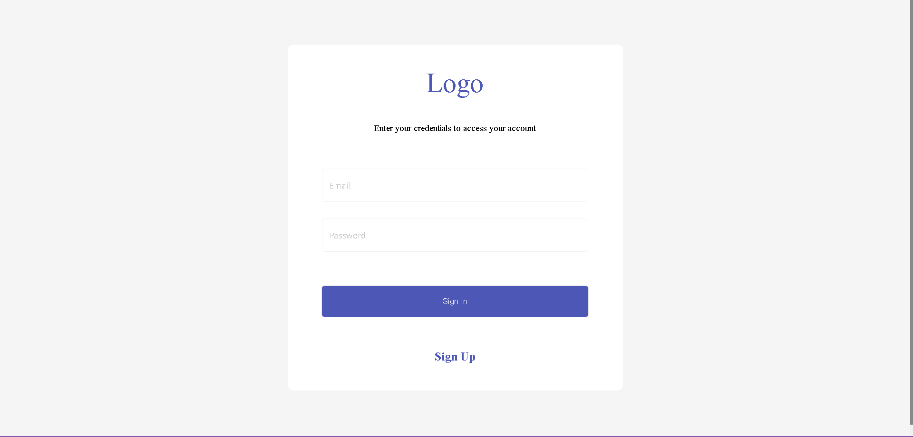
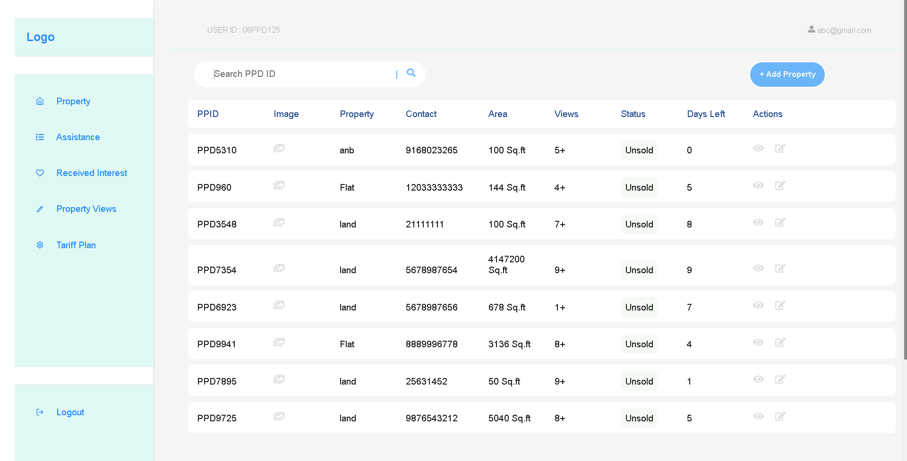
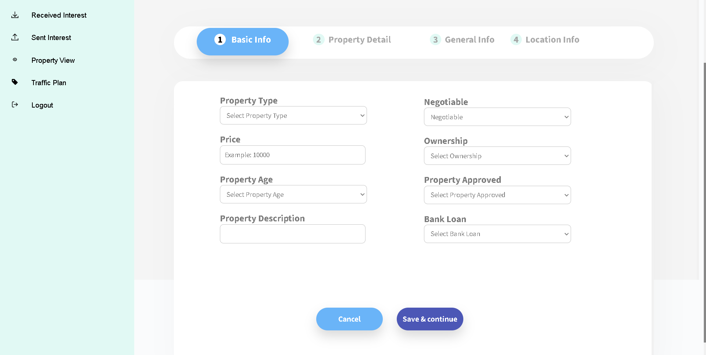
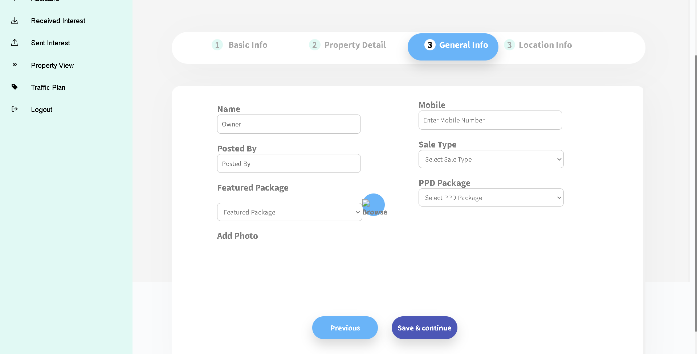
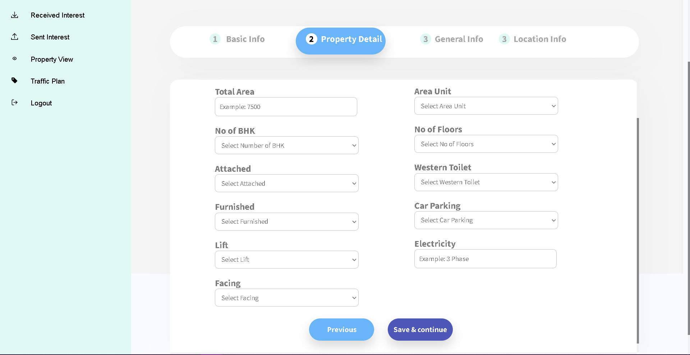
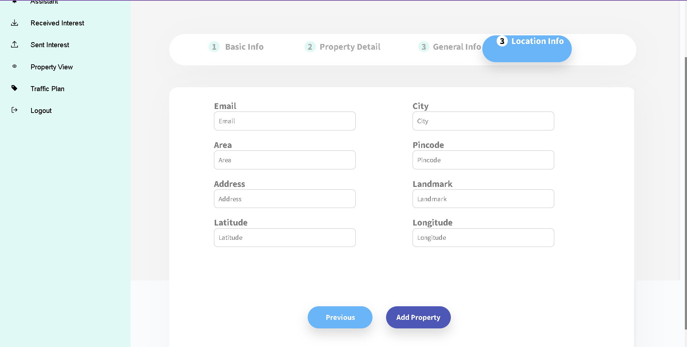

### Look Of It

 ## 1
 If the user is not signed up, this page helps to sign up the new user and creates a new account for them. Here Mail id will be checked if it already exists or not.The passwords minimum length should be 8 characters. Once the validation is successful, mail and password are stored in the Db. Password is stored after hashing it.

 

 ## 2
 All the registered users can now login with their credentials. If mailid doesn't exists we ask the user to first signup. If the credentials are correct we generate jwt from backend and send it to the frontend. the jwt is verified for everyrequest by the user.

 

 ## 3
 Here , the user can add a new property and also search the properties using property ID.
 
 
 
 ## 4
 
 
  
 ## 5
  
 
   
 ## 6
   
 
    
 ## 7
    
 
 
